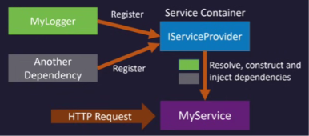

# Dependency Injection (DI) in .NET

## The Problem: Tight Coupling

When one service uses another, the subscriber directly constructs and uses the publisher's services. This creates issues:

- **Breaking Changes**: If the publisher changes, the subscriber breaks and needs re-engineering
- **Hard to Test**: Difficult to test the subscriber in isolation due to embedded publisher dependencies
- **Tight Coupling**: Services depend heavily on each other's implementation details

### Example
```
Subscriber constructs Publisher → Changes in Publisher break Subscriber
```

---

## The Solution: Dependency Injection

Instead of constructing the publisher inside the subscriber, **pass it as a constructor parameter**.

```csharp
// ❌ Bad - Tight Coupling
public class Subscriber
{
    private Publisher publisher = new Publisher(); // Subscriber constructs Publisher
}

// ✅ Good - Loose Coupling (Dependency Injection)
public class Subscriber
{
    private Publisher publisher;
    
    public Subscriber(Publisher publisher) // Publisher passed in
    {
        this.publisher = publisher;
    }
}
```

### Who Constructs and Configures Services?

**Answer: The Service Container (IServiceProvider)**

The service container:
- Registers all services during app startup
- Constructs and configures each service
- Provides services to subscribers when needed



---

## Benefits of DI

✅ **Loose Coupling**: Subscribers are unaffected by publisher changes  
✅ **Easy Configuration**: Subscriber doesn't need to know how to construct the publisher  
✅ **Testable**: Mock publishers can be injected for testing  
✅ **Maintainable**: Changes are isolated to the container configuration

---

## Service Lifetimes

### When Are Services Created?

Services are registered in the **Service Container at app startup**. When a subscriber needs a service, it's retrieved from the container.

### Three Lifetimes

#### 1. **Transient**
- A new instance is created **every time** it's requested
- Use for: Stateless services, lightweight objects

#### 2. **Singleton**
- A single instance is created **once** and reused for the entire app lifetime
- Use for: Database connections, configuration, expensive-to-create services

#### 3. **Scoped** (Current Discussion)
- A new instance is created **per request**
- The same instance is reused **within that request**
- A new instance is created for **each new request**

```csharp
// Example: Web Request Lifetime
Request 1 → Uses Instance A
Request 2 → Uses new Instance B
Request 3 → Uses new Instance C
```

---

## Setup Example

```csharp
// Register services in Program.cs
builder.Services.AddScoped<IPublisherService, PublisherService>();
builder.Services.AddScoped<ISubscriberService, SubscriberService>();

// The container now handles construction automatically
var subscriber = app.Services.GetRequiredService<ISubscriberService>();
```

---

## Summary

| Aspect | Problem | Solution |
|--------|---------|----------|
| **Coupling** | Subscriber constructs Publisher | Pass Publisher as parameter |
| **Testing** | Hard to test in isolation | Mock dependencies easily |
| **Configuration** | Scattered across services | Centralized in container |
| **Lifetime** | Unclear when to create/destroy | Scoped, Singleton, Transient |